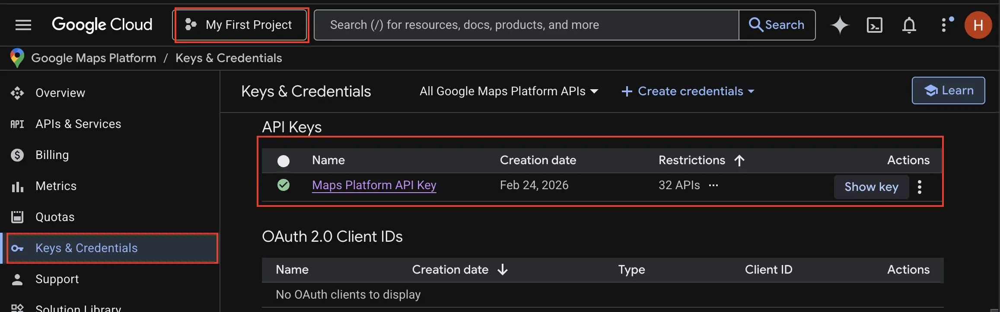
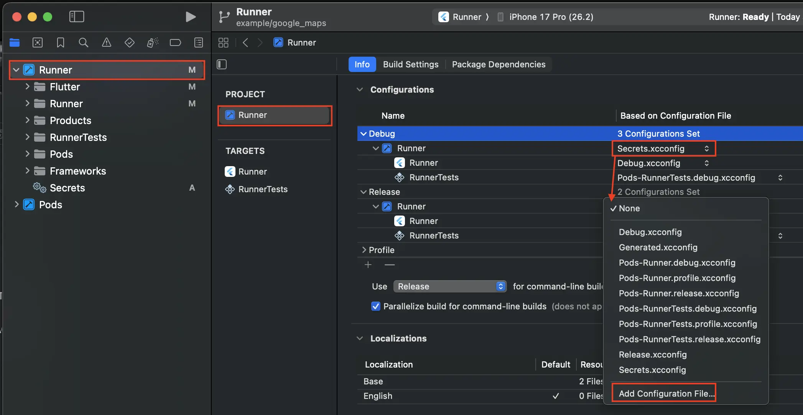

# Flutter Google Maps

Look for comments with `[!GoogleMapsConfig]` for detailed implementations. 

* 🚨 Get the maps key from your [Google Cloud Console](https://console.cloud.google.com/).




## Getting started 

- [Codelab](https://codelabs.developers.google.com/codelabs/google-maps-in-flutter#0).
- API Keys: To use Google Maps in your Flutter app, you need to configure an API project with the [Google Maps Platform](https://cloud.google.com/maps-platform/), following the [Maps SDK for Android's Using API key](https://developers.google.com/maps/documentation/android-sdk/signup), [Maps SDK for iOS' Using API key](https://developers.google.com/maps/documentation/ios-sdk/get-api-key), and [Maps JavaScript API's Using API key](https://developers.google.com/maps/documentation/javascript/get-api-key).

## Android
- 🚨 Add the api key to `android/local.properties` as `MAPS_API_KEY=<KEY>`. Make sure this is ignored in Git.

- Set `Android minSDK` to 21.
- Add API Key on `android/app/src/main/AndroidManifest.xml`.
```xml
<manifest ...>
    <application
        <!-- [!GoogleMapsConfig] -->
        <meta-data android:name="com.google.android.geo.API_KEY"
                android:value="<API_KEY>"/>
        <activity ...>
        </activity>
    </application>
</manifest>
```

## iOS

- 🚨 Create `ios/Flutter/Secrets.xcconfig` and set `MAPS_API_KEY=<KEY>` (make sure this is ignored in git).
- Set min iOS version to 14.0 in `ios/Podfile`: `platform :ios, '14.0'`.
- Open `ios/Runner.xcworkspace` in Xcode.
    - In the left panel, select `Runner`, then select `Runner` in project, then the `Info` tab. 
    - Expand Debug and Release, then in the Runner icon, click in None and select Add configuration file. Select Secrets.xcconfig. [More info](https://www.youtube.com/watch?v=WIam7qc1Hxc).

    

    - Make sure `<key>GoogleMapsApiKey</key><string>$(MAPS_API_KEY)</string>` is added in `ios/Runner/Info.plist`.
    - Finally, check that the `application` method `ios/Runner/AppDelegate.swift` is loading the key from `Info.plist`.
